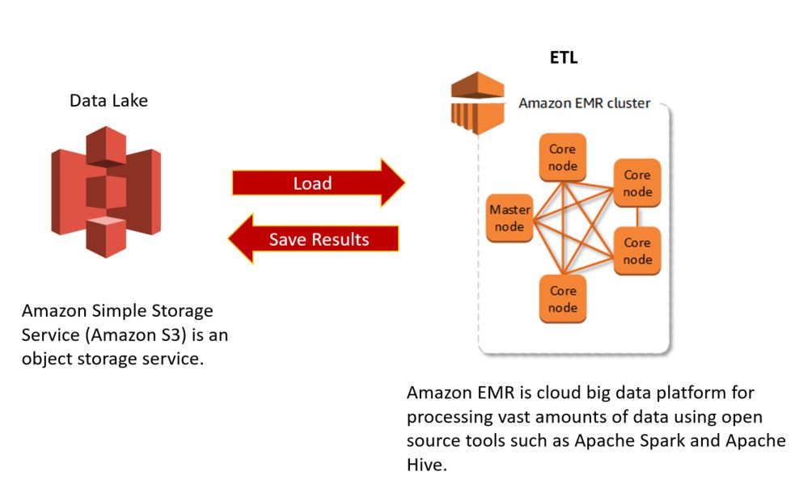
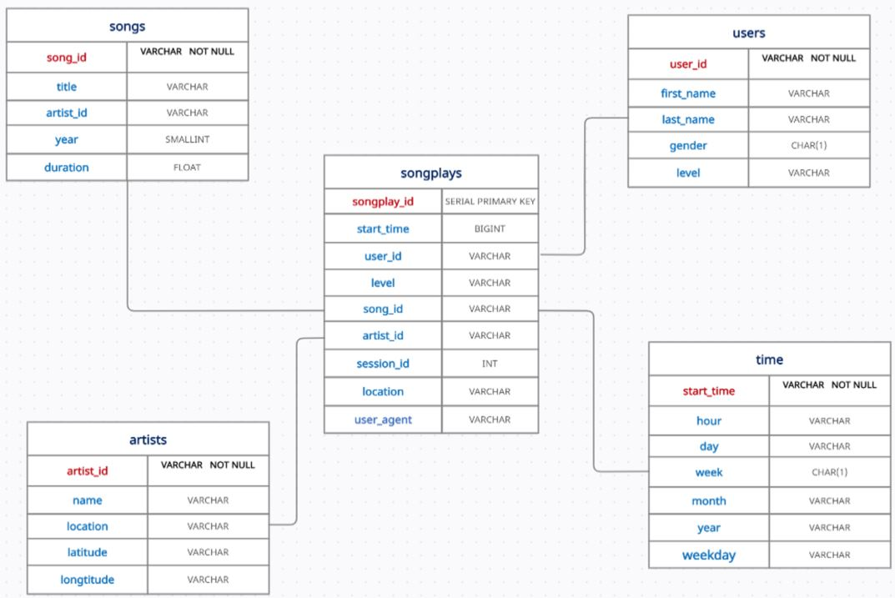
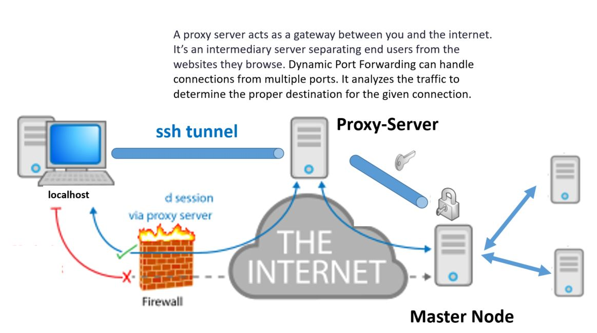
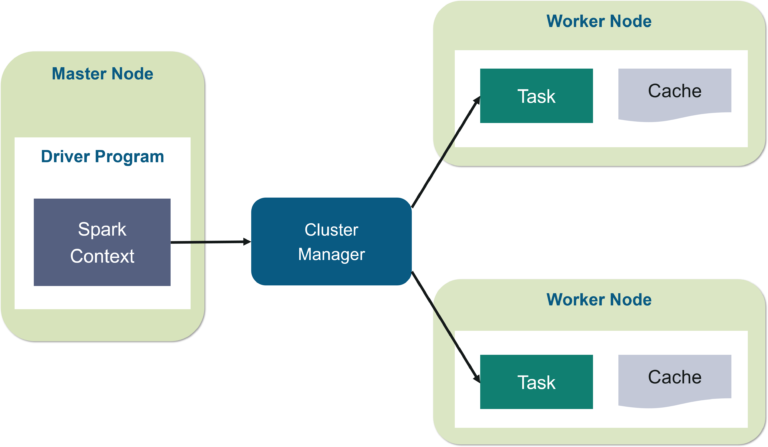

## Project Description
A startup called Sparkify wants to analyze the data that they've been collecting on songs and user's activity from their new music streaming app.  Their data resides in S3 in JSON format and can be categorized into : 

* **Song Datasets** :  Each file contains metadata about a song and the artist of that song. Below is an example of what a single song file looks like:

```{"num_songs": 1, "artist_id": "ARJIE2Y1187B994AB7", "artist_latitude": null, "artist_longitude": null, "artist_location": "", "artist_name": "Line Renaud", "song_id": "SOUPIRU12A6D4FA1E1", "title": "Der Kleine Dompfaff", "duration": 152.92036, "year": 0}```


* **Log Datasets** : Consists of log files generated by an event simulator based on the songs in the dataset above. Following is an example of what the data in a log file looks like: 


```{"artist":"Stephen Lynch", "auth" :"Logged In", "firstName":"Jayden", "gender" :"M", "itemInSession":0,"lastName" :"Bell", "length":182.85669, "level" :"free", "location":"Dallas-Fort Worth-Arlington, TX","method":"PUT", "page" :"NextSong", "registration":1540991795796, "sessionId":829, "song":"Jim Henson's Dead","status":200, "ts":1543537327796, "userAgent" :"Mozilla/5.0 (compatible; MSIE 10.0; Windows NT 6.2; WOW64; Trident/6.0)","userId" :"91}```

<br> 

---

## Project Task

The purpose of the project is to build an ETL pipeline on a Spark Cluster which it loads the data from the S3 bucket, create the dimensional tables and then save them into S3 bucket :




---

## Database Schema 

The database schema is a star schema and it is consisted of :

### **Fact Tables**:
1. **songplays** : records in log data associated with song plays  <br>
   **(songplay_id, start_time, user_id, level, song_id, artist_id, session_id, location, user_agent)**<br><br>

### **Dimension Tables**:
2. **users** : users in the music database  <br>
    **(user_id, first_name, last_name, gender, level)**<br><br>
        
3. **songs** : songs in the music database  <br>
    **(song_id, title, artist_id, year, duration)**<br><br>
    
4. **artists** : artists in the music database   <br>
   **(artist_id, name, location, latitude, longitude)**<br><br>
        
5. **time** : timestamps of records in songplays broken down into specific units  <br>
   **(start_time, hour, day, week, month, year, weekday)**<br><br>




--- 

## Project Files

The project has the following files:

* **README.md** : provides info about the project.
* **dl.cfg** : contains user's AWS credentials . (Access Key Id and Secret Access Key are used for programmatic (API) access to AWS service.)
* **etl.py** : reads data from S3, processes that data using Spark, and writes them back to S3

---

## Project Steps

1. Create a EMR cluster with the following specifications :
    * **Launch Mode** : Cluster
    * Software Configuration : 
        * **Release** : emr-5.20.0
        * **Applications** : Spark
    * Hardware Configuration :
        * **Instance Type** : m5.xlarge
        * **Number of Instances** : 3 (1 master and 2 core nodes)
    * Security and Access:
        * **EC2 key pair** : spark-cluster (Access Key Id and Secret Access Key are used for programmatic (API) access to AWS service.)
        * **Permissions** : Default

2. Log in to the master EC2 instance on the EMR cluster using the SSH protocol: 
    * Enable the Security Groups setting of the master EC2 instance to accept incoming SSH protocol from your local computer:
        * Find your Ip address by typing in the terminal : curl ifconfig.me (e.g. 34.123.83.196) 
        * Find the the security group **ElasticMapReduce-master** and the following inbound rule : 
            * Type : SSH
            * Protocol : TCP
            * Port : 22
            * Source : Custom
            * IP : 34.123.83.196
        * Type in the terminal : ssh -i spark-cluster.pem hadoop@Master_public_DNS

3. Transfer the etl.py. (See Extras)

4. Submit a Spark job : /usr/bin/spark-submit --master yarn ./etl.py  (See Extras)


---

## Extras : 

* For the purposes of the exercises you may need to install a SSH client program for logging into a remote Linux/Unix server  for executing commands on a remote server. SSHD is the daemon (service) program for ssh and runs on TCP port 22 on Ubuntu Linux. To install it type : **sudo apt-get install openssh-client** <br><br>

* By default PySpark uses Python 2.7. To change that, connect to the master node using SSH  and type : 

> sudo sed -i -e '$a\export PYSPARK_PYTHON=/usr/bin/python3' /etc/spark/conf/spark-env.sh 

<br>

* Transfer the etl.py to the master node:

    * **STEP 1**: Set Up an SSH Tunnel to the Master Node Using Dynamic Port Forwarding. Dynamic Port Forwarding allows a communication not on a single port, but across a range of ports. This port forwarding is created using -D parameter. This option will make SSH acts as a SOCKS proxy server. SOCKS5 is an internet protocol which routes packets between a server and a client using a proxy server. A SOCKS proxy is simply a SSH tunnel in which specific applications forward their traffic down the tunnel to the remote server. ([More Info](https://zaiste.net/posts/ssh-port-forwarding/))
    
     <br><br>

    * Enable the dynamic port forwarding using the command : ssh -i spark-cluster.pem -N -D 8157 hadoop@Master_public_DNS
    * Notes: 
         - Perhaps to edit the permissions of the spark-cluster.pem so user can read: chmod 400 spark-cluster.pem
         - You may need to kill the process that use the port 8157 from previous run : lsof -ti:8157 | xargs kill -9  (install it : apt-get install lsof) <br>
         - Syntax of ssh : 
            > **ssh -i identity_file -N -D port username@hostname** <br>
            > **where** <br>
            > **-i identity_file** : A file from which the identity key (private key) for public key authentication is read.<br>
            > **-N** : Do not execute a remote command.  This is useful for just forwarding ports <br>
            > **-D [bind_address:]port** : Dynamic application-level port forwarding.    Specifies that the given port on the local (client) host is to be forwarded to the given host and port on the remote side.  This works by allocating a socket to listen to port on the local side, optionally bound to the specified bind_address.  Whenever a connection is made to this port, the connection is forwarded over the secure channel, and a connection is made to host port hostport from the remote machine. <br> <br>

    * **STEP 2**: Copy your etl file to the master node:  scp -i spark-cluster.pem spark-cluster.pem hadoop@Master_public_DNS:/home/hadoop/
<br><br>
        


                
*  **Spark Cluster Architecture**:

    * In your master node, you have the driver program, which drives your application. Τhe code you are writing behaves as a driver program or if you are using the interactive shell, 
the shell acts as the driver program. Inside the driver program, the first thing you do is, you create a **Spark Context**. This Spark context works with the cluster manager to manage various jobs. <br><br>
    * The driver program & Spark context takes care of the job execution within the cluster. A job is split into multiple tasks which are distributed over the worker node. **Anytime an RDD is created in Spark context, it can be distributed across various nodes and can be cached there.** <br><br>
    * Worker nodes are the slave nodes whose job is to basically execute the tasks. **These tasks are then executed on the partitioned RDDs in the worker node and hence returns back the result to the Spark Context.**<br><br>
    

        * **STEP 1**: The client submits spark user application code. When an application code is submitted, the driver implicitly converts user code that contains transformations and actions into a logically directed acyclic graph called DAG. At this stage, it also performs optimizations such as pipelining transformations.<br><br>
        * **STEP 2**: After that, it converts the logical graph called DAG into physical execution plan with many stages. After converting into a physical execution plan, it creates physical execution units called tasks under each stage. Then the tasks are bundled and sent to the cluster.<br><br>
        * **STEP 3**: Now the driver talks to the cluster manager and negotiates the resources. Cluster manager launches executors in worker nodes on behalf of the driver. At this point, the driver will send the tasks to the executors based on data placement. When executors start, they register themselves with drivers. So, the driver will have a complete view of executors that are executing the task.<br><br>
        * **STEP 4**: During the course of execution of tasks, driver program will monitor the set of executors that runs. Driver node also schedules future tasks based on data placement. 
<br><br>

*  **Vim** :
    You can use the same command to create or open a file in Vim: vim FILE_NAME
    Following are the **basics modes** in Vim :

    * **Normal** (Default) : for navigation and simple editing
        * Esc switches to Normal mode

    * **Insert** : For explicitly inserting and modifying text
        * Hit Esc to make sure you are in Normal mode, then press i to go into Insert mode (In the lower-left, you should see -- INSERT --)
    
    * **Command Line** : For operations like saving, exiting, etc. 
        * Pressing the colon (:) in Normal mode switches Vim to Command Line mode. 
        * Some basic Vim commands:
            - :w  - Saves the file you are working on
            - :wq - Save your file and close Vim
            - :q! - Quit without first saving the file you were working on
